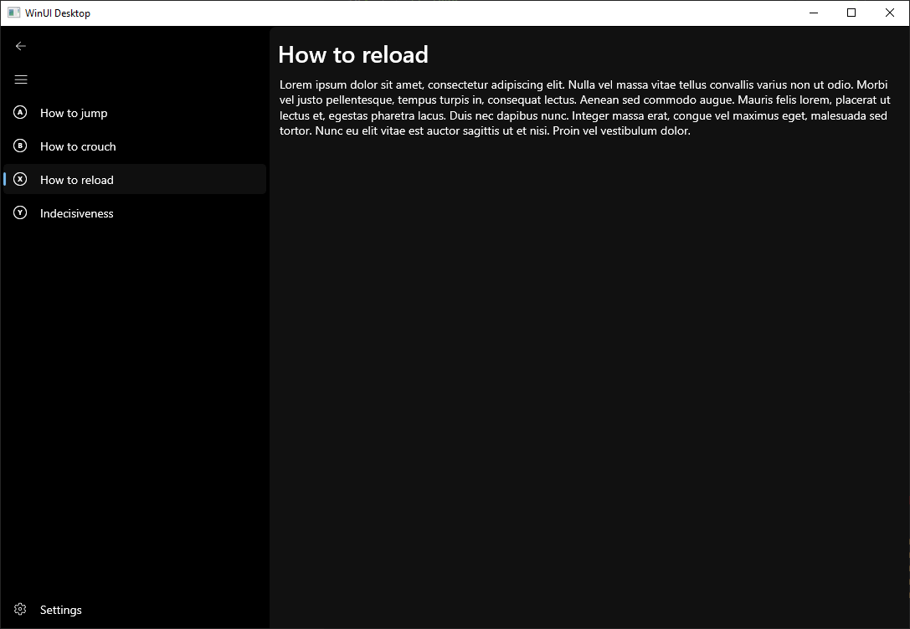

# WinUI 3, C++/WinRT, and Xaml with CMake

## Requirements

* CMake 3.23 (April 2022) with the MSBuild generator is required
* Windows App SDK 1.1 (June 2022); this uses self-contained mode to solve several problems, which is new in 1.1

## Notes

For a real-world application, see https://github.com/openkneeboard/openkneeboard

* Xaml-related header files **must** be listed as targert sources
* The `Directory.Build.targets` file is currently required; it slightly modifies the CMake generator
* I've avoided `use namespace` to be explicit; I'm not aiming for this to be 'best practice', just to be unambiguous and minimal
* `pch.h` and its' contents are required by the generated code
* `pch.h` is not currently a pre-compiled header
